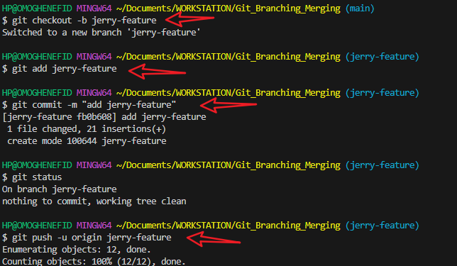

## GIT BRANCHING AND MERGING
This project demonstrates effective use of Git for collaborative development, focusing on branching, merging, conflict creation, and resolution.

To enable parallel development, multiple feature branches were created from the main branch using:
tom-feature and jerry-feature.
Each branch was dedicated to a specific feature or team member’s contribution, allowing isolated development without affecting the main project.

## Merging Branches
After completing changes on each feature branch, they were merged into the main branch.
Pull Requests (PRs) were created for each branch to facilitate code review and integration. Screenshots were provided to demonstrate successful PR creation and merging via GitHub.

## Merge Conflicts
During the merge process, conflicts occurred when two branches modified the same part of a file.

##  Conflict Resolution Process
Conflicts were resolved by manually editing the affected files to choose or combine the changes after editing.

## Conclusion
The Git Branching and Merging project provided hands-on experience with:

Creating and switching branches

Pushing and pulling from remotes

Creating Pull Requests on GitHub

Merging branches

Resolving merge conflicts

## Below are screenshot to show workflow:

